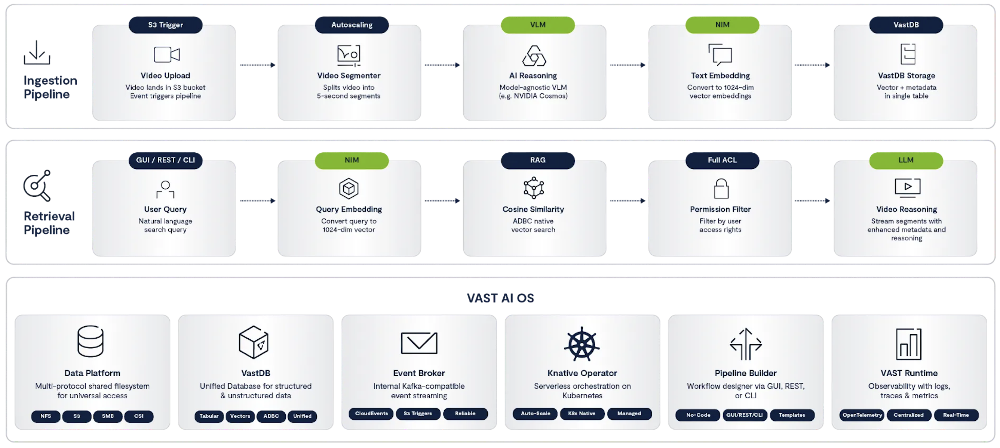

# VAST DataEngine - Video Search and Summarization (VSS) Foundation Stack


- A Real-Time Video Search and Analysis system powered by [VAST DataEngine](https://www.vastdata.com/platform/dataengine), using [Nvidia NIM's](https://www.nvidia.com/en-eu/ai-data-science/products/nim-microservices/) & [Cosmos-Reason Models](https://huggingface.co/nvidia/Cosmos-Reason2-8B).

- This Blueprint is were released to bridge the gap between [NVIDIA’s VSS reference architectures](https://build.nvidia.com/nvidia/video-search-and-summarization/blueprintcard), and showcases the e2e utilization of the full VAST AI OS production-grade capabilities,
including Agentic & Serverless Event-based Compute Framework and VastDB Vector-Store.

---

## Overview

The system has two main parts:
1. **K8s Application** - Web UI and REST API (Kubernetes)
2. **Ingest Pipeline** - Serverless video processing (VAST DataEngine)



---

## Deployment

| Component | Guide |
|-----------|-------|
| **VSS - Retrieval Web UI; K8s Application** (Backend, Frontend, Streaming, Batch Sync) | [vss-k8s-application](deployments/vss-k8s-application/README.md) |
| **VSS - DataEngine; Ingest Pipeline** (Segmenter, Reasoner, Embedder, Writer) | [dataengine-vss-ingest-pipeline](deployments/dataengine-vss-ingest-pipeline/README.md) |

### Quick Start

1. **Deploy K8s Application:**
   ```bash
   cd deployments/vss-k8s-application
   vim backend-secret.yaml  # Configure credentials
   ./QUICK_DEPLOY.sh <namespace> <cluster_name>
   ```

2. **Deploy Ingest Pipeline** (choose one):
   - **Using GUI:** Configure `vss-gui-secret-file-template.yaml`, then use DataEngine UI
   - **Using CLI:** Configure `vss-cli-secret-file-template.yaml`, then run vastde commands
   
   See [Ingest Pipeline Guide](deployments/dataengine-vss-ingest-pipeline/README.md) for full instructions.

3. **Test:** Upload a video and search at `http://video-lab.<cluster_name>.vastdata.com`

---

## Key Features

| Feature | Description | Documentation |
|---------|-------------|---------------|
| **Video Analysis Prompts** | Configurable AI scenarios (surveillance, traffic, sports, etc.) | [video-reasoner](source-code/ingest/video-reasoner/README.md) |
| **Custom AI Prompts** | Per-video custom prompts (max 800 chars) | [video-reasoner](source-code/ingest/video-reasoner/README.md#custom-prompts) |
| **Metadata Filters** | Filter by camera_id, location, capture_type | [ingest](source-code/ingest/README.md) |
| **LLM Settings** | Adjustable search/synthesis parameters | [video-backend](source-code/retrieval/video-backend/README.md#gui-settings) |
| **Time Filtering** | Filter by upload time (presets or custom range) | [video-backend](source-code/retrieval/video-backend/README.md#gui-settings) |
| **Video Streaming** | Capture YouTube videos to S3 | [video-streaming](source-code/video-streaming/README.md) |
| **Batch Sync** | Copy MP4 files between S3 buckets | [video-batch-sync](source-code/video-batch-sync/README.md) |
| **Authentication** | VAST username + password | [video-backend](source-code/retrieval/video-backend/README.md) |

---

## Component Documentation

| Component | Description |
|-----------|-------------|
| [video-backend](source-code/retrieval/video-backend/README.md) | REST API, authentication, search |
| [video-frontend](source-code/retrieval/video-frontend/README.md) | Angular web UI |
| [video-streaming](source-code/video-streaming/README.md) | YouTube capture service |
| [video-batch-sync](source-code/video-batch-sync/README.md) | S3 batch copy service |
| [video-segmenter](source-code/ingest/video-segmenter/README.md) | Splits videos into segments |
| [video-reasoner](source-code/ingest/video-reasoner/README.md) | AI video analysis |
| [video-embedder](source-code/ingest/video-embedder/README.md) | Vector embeddings |
| [vastdb-writer](source-code/ingest/vastdb-writer/README.md) | Stores vectors in VastDB |

---

## Pipeline Flow

```
Upload Video → video-chunks bucket
                    ↓
            video-segmenter
                    ↓
        video-chunks-segments bucket
                    ↓
            video-reasoner (AI analysis)
                    ↓
            video-embedder (vectors)
                    ↓
            vastdb-writer (store)
                    ↓
              Search Ready
```

---

## Need Help?

- **K8s Deployment**: See [K8s Application Guide](deployments/vss-k8s-application/README.md#troubleshooting)
- **Ingest Pipeline**: See [Ingest Pipeline Guide](deployments/dataengine-vss-ingest-pipeline/README.md)
- **Community**: [VAST Community Forums](https://community.vastdata.com/)
